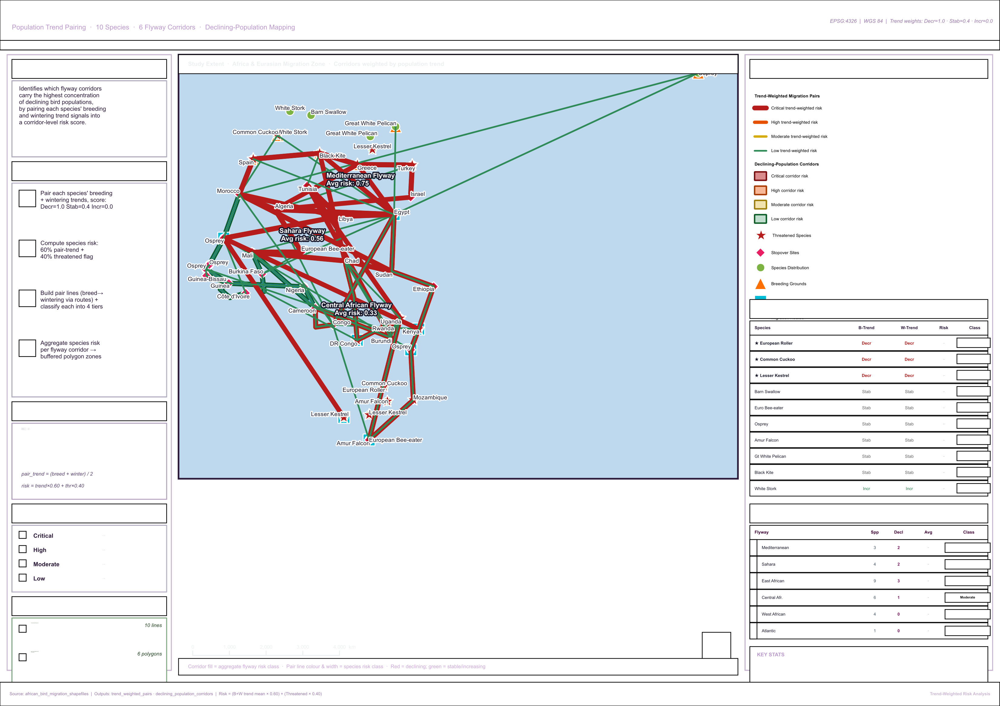

# African Bird Migration — Trend-Weighted Risk Analysis

> **A population-trend-driven corridor analysis** that pairs each species' breeding
> and wintering population trends to produce a per-species risk score, then
> aggregates these scores per flyway corridor to identify which migration
> corridors carry the highest concentration of declining-population species.

---

## Table of Contents

1. [Project Overview](#project-overview)
2. [How This Differs from the Other Analyses](#how-this-differs)
3. [Folder Structure](#folder-structure)
4. [Input Layers](#input-layers)
5. [Output Layers](#output-layers)
6. [Methodology — Step-by-Step](#methodology)
7. [Trend Scoring & Risk Formula](#formulas)
8. [Classification Thresholds](#classification-thresholds)
9. [Results](#results)
10. [Layer Symbology](#layer-symbology)
11. [Project Configuration](#project-configuration)
12. [Reference Map](#reference-map)
13. [How to Reproduce](#how-to-reproduce)
14. [File Inventory](#file-inventory)

---

## Project Overview

| Property | Value |
|---|---|
| **Project title** | African Bird Migration — Trend-Weighted Risk Analysis |
| **Project file** | `African_Bird_Trend_Risk.qgz` |
| **CRS** | EPSG:4326 — WGS 84 |
| **Spatial extent** | -22°W to 115°E, -38°S to 66°N |
| **Species analysed** | 10 |
| **Flyway corridors scored** | 6 |
| **Corridor buffer** | 0.45° (≈ 50 km) |
| **QGIS version** | 3.40.14-Bratislava |

The central question this analysis answers:

> **Which migration corridors carry the highest concentration of declining bird
> populations, and which species pairs are at the greatest combined risk?**

Whereas the corridor vulnerability analysis aggregated all species pressures
into a corridor score, this analysis focuses specifically on the **direction of
population change** — pairing each species' breeding and wintering trends
(Decreasing / Stable / Increasing) into a single risk score, then mapping where
those declining species concentrate geographically.

---

## How This Differs

| Aspect | Corridor Vulnerability | Criticality Network | Habitat Dependency | **Trend-Weighted Risk** |
|---|---|---|---|---|
| **Risk dimension** | Spatial pressure | Network structure | Ecological niche | **Population direction** |
| **Question** | Which corridors are pressured? | Which sites strand species? | Who's specialised? | **Where are declines concentrated?** |
| **Key metric** | Vulnerability index | Criticality index | Shannon H | **Pair-trend × threatened** |
| **Output features** | 6 polygons | 96 pts + 10 lines | 10 species pts | **10 lines + 6 polygons** |

All four analyses use the same six input datasets and complement one another —
this one specifically captures the **temporal trajectory** of bird populations,
a dimension absent from the other three.

---

## Folder Structure

```
African_Bird_Trend_Risk/
│
├── African_Bird_Trend_Risk.qgz             (73.4 KB)
│   └── 8 layers, symbology, labels, draw order, layout
│
├── README.md
│
├── Input_layers/
│   ├── migration_routes.gpkg               (104.0 KB  |  27 features)
│   ├── stopover_sites.gpkg                 (116.0 KB  |  96 features)
│   ├── species_distribution.gpkg           (112.0 KB  |  94 features)
│   ├── threatened_species_priority.gpkg    ( 96.0 KB  |  30 features)
│   ├── breeding_grounds.gpkg               ( 96.0 KB  |  10 features)
│   └── wintering_grounds.gpkg              ( 96.0 KB  |  10 features)
│
└── Output_layer/
    ├── trend_weighted_pairs.gpkg           ( 96.0 KB  |  10 features)
    ├── declining_population_corridors.gpkg ( 96.0 KB  |   6 features)
    └── reference_layout.png                (  800 KB  |  200 dpi, A3)
```

---

## Input Layers

All six layers are in **EPSG:4326 (WGS 84)** stored as GeoPackages in `Input_layers/`.
The `trend` field in `breeding_grounds` and `wintering_grounds` is the primary input.

| Layer | File | Geometry | Features | Used For |
|---|---|---|---|---|
| Breeding Grounds | `breeding_grounds.gpkg` | Point | 10 | `species`, `trend`, `region` |
| Wintering Grounds | `wintering_grounds.gpkg` | Point | 10 | `species`, `trend`, `region` |
| Migration Routes | `migration_routes.gpkg` | LineString | 27 | Flyway-grouped dissolve & buffer |
| Threatened Species | `threatened_species_priority.gpkg` | Point | 30 | Threatened-status flag |
| Stopover Sites | `stopover_sites.gpkg` | Point | 96 | Map context |
| Species Distribution | `species_distribution.gpkg` | Point | 94 | Map context |

### Trend Values in Dataset

| Trend | Count (breeding) | Species |
|---|---|---|
| **Decreasing** | 3 | European Roller, Common Cuckoo, Lesser Kestrel |
| **Stable** | 6 | Barn Swallow, European Bee-eater, Osprey, Amur Falcon, Great White Pelican, Black Kite |
| **Increasing** | 1 | White Stork |

All 3 declining species are also in the threatened layer — perfect alignment between
trend signal and conservation status.

---

## Output Layers

### 1. `trend_weighted_pairs.gpkg` — 10 features (LineString)

One LineString per species, connecting breeding ground → migration route vertices
→ wintering ground, with full risk metrics attached.

| Field | Type | Description |
|---|---|---|
| `species` | String | Species common name |
| `family` | String | Taxonomic family |
| `threatened` | Integer | 1 = threatened, 0 = not |
| `status` | String | IUCN-style status from breeding layer |
| `breed_trend` | String | Breeding-ground population trend |
| `winter_trend` | String | Wintering-ground population trend |
| `pair_trend_score` | Real | Mean of breeding + wintering trend scores (0–1) |
| `risk_score` | Real | Composite trend-weighted risk score (0–1) |
| `risk_class` | String | Critical / High / Moderate / Low |
| `flyways` | String | Comma-separated flyways used |
| `breed_region` | String | Breeding region description |
| `winter_region` | String | Wintering region description |
| `total_km` | Real | Reconstructed journey distance (km) |

### 2. `declining_population_corridors.gpkg` — 6 features (Polygon)

Per-flyway corridor polygons (50 km buffered routes) scored by aggregate
trend-weighted species risk.

| Field | Type | Description |
|---|---|---|
| `flyway` | String | Flyway name |
| `n_species` | Integer | Total species using this flyway |
| `n_declining` | Integer | Species with declining breeding OR wintering trend |
| `n_threatened` | Integer | Threatened species using this flyway |
| `total_risk` | Real | Sum of species risk scores |
| `avg_risk` | Real | Average species risk score for this corridor |
| `corridor_class` | String | Critical / High / Moderate / Low |
| `species_list` | String | Comma-separated all species using flyway |
| `declining_spp` | String | Comma-separated declining species using flyway |

---

## Methodology

### Phase 1 — Trend-Score Mapping

For each species, the breeding and wintering ground trend strings are converted
to numeric severity scores:

```
Decreasing  →  1.0   (highest risk signal)
Stable      →  0.4   (mild concern)
Increasing  →  0.0   (no risk signal)
```

### Phase 2 — Per-Species Risk Score

```
pair_trend_score = (breeding_score + wintering_score) / 2
risk_score       = pair_trend_score × 0.60 + threatened × 0.40
```

This formula gives 60% weight to direct trend evidence and 40% to conservation
status. A species declining at both ends with threatened status scores 1.000
(maximum); a stable non-threatened species scores 0.240; an increasing
non-threatened species scores 0.000.

### Phase 3 — Pair Line Geometry

For each species, a LineString is constructed:

```
breeding_pt → dissolved_route_vertices → wintering_pt
```

Routes are dissolved per species (`QgsGeometry.unaryUnion`), then their vertices
are inserted between the breeding and wintering anchors. Total distance is
computed via the Haversine formula across all consecutive vertex pairs.

### Phase 4 — Corridor Aggregation

Routes are grouped by their `flyway` field (not by species — a species can use
multiple flyways). For each flyway:

```
1. Dissolve all route segments labelled with that flyway
2. Buffer by 0.45° (~50 km)
3. Find all species using this flyway (from any segment)
4. Sum their risk scores and average → corridor risk class
```

This corridor approach correctly handles species that use multiple flyways —
each flyway's risk reflects the **actual mix of species traveling through it**,
not an arbitrary first-alphabetical assignment.

---

## Formulas

### Trend-Score Mapping

```
Decreasing  =  1.0
Stable      =  0.4
Increasing  =  0.0
```

### Pair Trend Score

```
pair_trend = (breed_trend_score + winter_trend_score) / 2
```

### Composite Risk Score

```
risk = pair_trend × 0.60 + threatened × 0.40
```

### Corridor Aggregate Risk

```
avg_risk = Σ(species_risk) / n_species_in_flyway
```

### Weight Rationale

| Component | Weight | Rationale |
|---|---|---|
| Pair trend | 60% | Direct evidence — observed population change is the strongest signal of risk trajectory |
| Threatened flag | 40% | Conservation-status uplift — species already at population risk warrant additional weighting even if their trend is mild |

---

## Classification Thresholds

Identical thresholds applied to both species risk scores and corridor aggregate scores:

| Class | Score Range | Colour | Hex |
|---|---|---|---|
| **Critical** | ≥ 0.70 | Dark Red | `#b71c1c` |
| **High** | ≥ 0.45 | Burnt Orange | `#e65100` |
| **Moderate** | ≥ 0.25 | Amber | `#d4ac0d` |
| **Low** | < 0.25 | Forest Green | `#1e8449` |

---

## Results

### Per-Species Risk Scores

| Rank | Species | Threatened | Breeding | Wintering | Risk | Class |
|---|---|---|---|---|---|---|
| 1 | European Roller | ★ | Decreasing | Decreasing | **1.000** | Critical |
| 1 | Common Cuckoo | ★ | Decreasing | Decreasing | **1.000** | Critical |
| 1 | Lesser Kestrel | ★ | Decreasing | Decreasing | **1.000** | Critical |
| 4 | Barn Swallow | — | Stable | Stable | 0.240 | Low |
| 4 | European Bee-eater | — | Stable | Stable | 0.240 | Low |
| 4 | Osprey | — | Stable | Stable | 0.240 | Low |
| 4 | Amur Falcon | — | Stable | Stable | 0.240 | Low |
| 4 | Great White Pelican | — | Stable | Stable | 0.240 | Low |
| 4 | Black Kite | — | Stable | Stable | 0.240 | Low |
| 10 | White Stork | — | Increasing | Increasing | 0.000 | Low |

### Per-Corridor Risk Aggregation

| Rank | Flyway | Spp | Declining | Threatened | Avg Risk | Class |
|---|---|---|---|---|---|---|
| 1 | **Mediterranean Flyway** | 3 | 2 | 2 | **0.747** | 🔴 Critical |
| 2 | **Sahara Flyway** | 4 | 2 | 2 | **0.560** | 🟠 High |
| 3 | **East African Flyway** | 9 | 3 | 3 | **0.467** | 🟠 High |
| 4 | Central African Flyway | 6 | 1 | 1 | 0.327 | 🟡 Moderate |
| 5 | West African Flyway | 4 | 0 | 0 | 0.240 | 🟢 Low |
| 6 | Atlantic Flyway | 1 | 0 | 0 | 0.240 | 🟢 Low |

### Key Findings

- **Perfect signal alignment.** All 3 declining species (European Roller,
  Common Cuckoo, Lesser Kestrel) are also threatened, and their breeding AND
  wintering trends are both Decreasing — meaning the populations are losing
  ground at both ends of their annual cycle. This is the strongest possible
  risk signal in the dataset and reaches the maximum risk score (1.000).

- **Mediterranean Flyway is the highest-risk corridor** despite hosting only 3
  species — because 2 of those 3 are critically declining (European Roller and
  Lesser Kestrel). Average risk per species (0.747) is the highest of any
  corridor.

- **East African Flyway has the most absolute exposure** — all 3 critical
  species pass through it (highest n_threatened = 3), but its risk is diluted
  by 6 stable-population species also using it.

- **West African and Atlantic flyways carry no declining populations.** From a
  trend perspective these are conservation-resilient corridors. Their risk
  scores reflect only the baseline 0.240 from stable-trend birds.

- **White Stork is the only species with an increasing trend** at both
  breeding and wintering grounds — making it the lowest-risk species in the
  dataset (score = 0.000) and a possible conservation success story.

- **Three flyways are above the Moderate threshold** (Mediterranean, Sahara,
  East African) and together carry every declining species in the dataset.

---

## Layer Symbology

| Layer | Geometry | Symbol | Colour | Width/Size |
|---|---|---|---|---|
| Trend-Weighted Pairs — Critical | LineString | Solid | `#b71c1c` | 2.0 pt |
| Trend-Weighted Pairs — High | LineString | Solid | `#e65100` | 1.4 pt |
| Trend-Weighted Pairs — Moderate | LineString | Solid | `#d4ac0d` | 1.0 pt |
| Trend-Weighted Pairs — Low | LineString | Solid | `#2e8b57` | 0.7 pt |
| Corridors — Critical | Polygon | Fill | `#b71c1c` α=130 | — |
| Corridors — High | Polygon | Fill | `#e65100` α=105 | — |
| Corridors — Moderate | Polygon | Fill | `#d4ac0d` α=85 | — |
| Corridors — Low | Polygon | Fill | `#1e8449` α=70 | — |
| Migration Routes | LineString | Solid | `#1a78c2` | 1.0 pt |
| Stopover Sites | Point | Diamond | `#e91e63` | 4.0 pt |
| Species Distribution | Point | Circle | `#7cb342` | 3.5 pt |
| Threatened Species | Point | Star | `#b71c1c` | 5.5 pt |
| Breeding Grounds | Point | Triangle | `#ff6f00` | 5.0 pt |
| Wintering Grounds | Point | Square | `#00bcd4` | 5.0 pt |

**Draw order (top to bottom):**
Trend-Weighted Pairs → Threatened Species → Stopover Sites → Species Distribution
→ Breeding Grounds → Wintering Grounds → Migration Routes → Declining Corridors

Pair lines show species name + risk score on hover/label.
Corridors show flyway name + average risk in the centre.

---

## Project Configuration

| Setting | Value |
|---|---|
| CRS | EPSG:4326 — WGS 84 |
| Snapping | Enabled · All Layers · Vertex + Segment · 10 px tolerance |
| Layer sources | All GeoPackages in project folder — zero broken links |
| Print layout | `Trend Risk Reference Map` — A3 Landscape, 200 dpi |

---

## Reference Map

`Output_layer/reference_layout.png` — 800 KB, 200 dpi, A3 Landscape, 216 layout items

**Left panel — Analysis notes:**
Project overview · 4-step methodology · Trend scoring scale · Corridor risk thresholds
with colour swatches · Output layer reference

**Centre — Main map (235 mm wide):**
Full Africa-Eurasia extent · Corridor polygons coloured by aggregate risk class
underneath · Species pair lines on top, weighted by per-species risk · All 6 reference
layers active · Scale bar · North arrow

**Right panel — Results:**
Auto-generated map legend · Per-species risk table (10 rows with breeding/wintering
trends colour-coded — declining bold red, stable grey, increasing green — risk score
and class badge) · Per-corridor risk table (6 rows ranked by avg risk with class
badges) · 4-metric stats summary

---

## How to Reproduce

### Prerequisites

- QGIS 3.x (tested on 3.40.14-Bratislava)
- Python 3 with PyQGIS

### Steps

1. Open `African_Bird_Trend_Risk.qgz` — all 8 layers load with zero relinking.
2. Open `trend_weighted_pairs` attribute table to inspect per-species scores.
3. Open `declining_population_corridors` attribute table for corridor-level aggregates.
4. Open the `Trend Risk Reference Map` layout from the Layout Manager to re-export.

### PyQGIS Pseudocode

```python
from collections import defaultdict

TREND_SCORE = {'Decreasing': 1.0, 'Stable': 0.4, 'Increasing': 0.0}

# Phase 1+2: Per-species risk
for sp in all_species:
    bt = TREND_SCORE[breed[sp]['trend']]
    wt = TREND_SCORE[winter[sp]['trend']]
    pair_trend = (bt + wt) / 2
    risk = pair_trend * 0.60 + (1.0 if sp in threatened else 0.0) * 0.40

# Phase 3: Build pair lines
    merged_route = QgsGeometry.unaryUnion(species_routes[sp])
    pair_pts = [breed_pt] + route_vertices + [winter_pt]
    pair_geom = QgsGeometry.fromPolylineXY(pair_pts)

# Phase 4: Aggregate by flyway
flyway_routes = defaultdict(list)
flyway_species = defaultdict(set)
for f in routes_layer.getFeatures():
    flyway_routes[f['flyway']].append(f.geometry())
    flyway_species[f['flyway']].add(f['species'])

for fw, geoms in flyway_routes.items():
    avg_risk = sum(species_risk[sp] for sp in flyway_species[fw]) / len(flyway_species[fw])
    buffered = QgsGeometry.unaryUnion(geoms).buffer(0.45, 16)
```

### Critical Replication Notes

- **Group routes by `flyway` field, not by species.** A species can use multiple
  flyways; if you assign each species to one main flyway, you mis-count which
  species pass through each corridor. The correct approach iterates the routes
  layer once and groups by the flyway label.
- **Both endpoints contribute equally** to the pair trend score. If asymmetric
  weighting is needed (e.g., breeding habitat as the primary driver of
  population trajectory), adjust the formula in Phase 2.
- **Threatened flag is binary**, not graded. The `priority` field in the
  threatened layer contains High/Medium values but is not currently used —
  presence in the threatened layer at all triggers the +0.40 uplift.
- **Trend mapping is conservative.** Stable = 0.4 (not 0.0) acknowledges that
  even stable populations carry baseline migration risk; setting it to 0.0
  would make all stable-trend corridors exactly equivalent to no-data corridors.

---

## File Inventory

| File | Folder | Size | Description |
|---|---|---|---|
| `African_Bird_Trend_Risk.qgz` | Root | 73.4 KB | QGIS project |
| `README.md` | Root | — | This file |
| `migration_routes.gpkg` | `Input_layers/` | 104.0 KB | 27 route lines |
| `stopover_sites.gpkg` | `Input_layers/` | 116.0 KB | 96 stopover sites |
| `species_distribution.gpkg` | `Input_layers/` | 112.0 KB | 94 distribution points |
| `threatened_species_priority.gpkg` | `Input_layers/` | 96.0 KB | 30 threatened species |
| `breeding_grounds.gpkg` | `Input_layers/` | 96.0 KB | 10 breeding grounds (primary input) |
| `wintering_grounds.gpkg` | `Input_layers/` | 96.0 KB | 10 wintering grounds (primary input) |
| `trend_weighted_pairs.gpkg` | `Output_layer/` | 96.0 KB | 10 risk-scored journey lines |
| `declining_population_corridors.gpkg` | `Output_layer/` | 96.0 KB | 6 buffered corridor polygons |
| `reference_layout.png` | `Output_layer/` | 800.0 KB | A3 reference map 200 dpi |

---

*African Bird Migration — Trend-Weighted Risk Analysis*
*CRS: EPSG:4326  ·  Trend weights: Decr=1.0 · Stab=0.4 · Incr=0.0*
*Risk: pair_trend × 0.60 + threatened × 0.40  ·  Buffer: 0.45° ≈ 50 km*
*QGIS 3.40.14-Bratislava  ·  PyQGIS trend-weighted scoring pipeline*

---

## Map Preview



